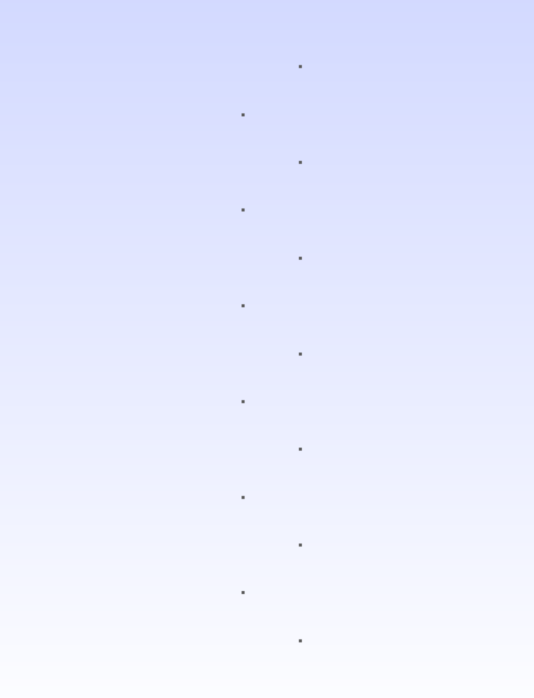
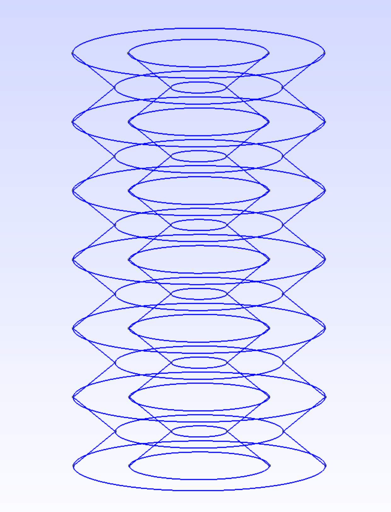
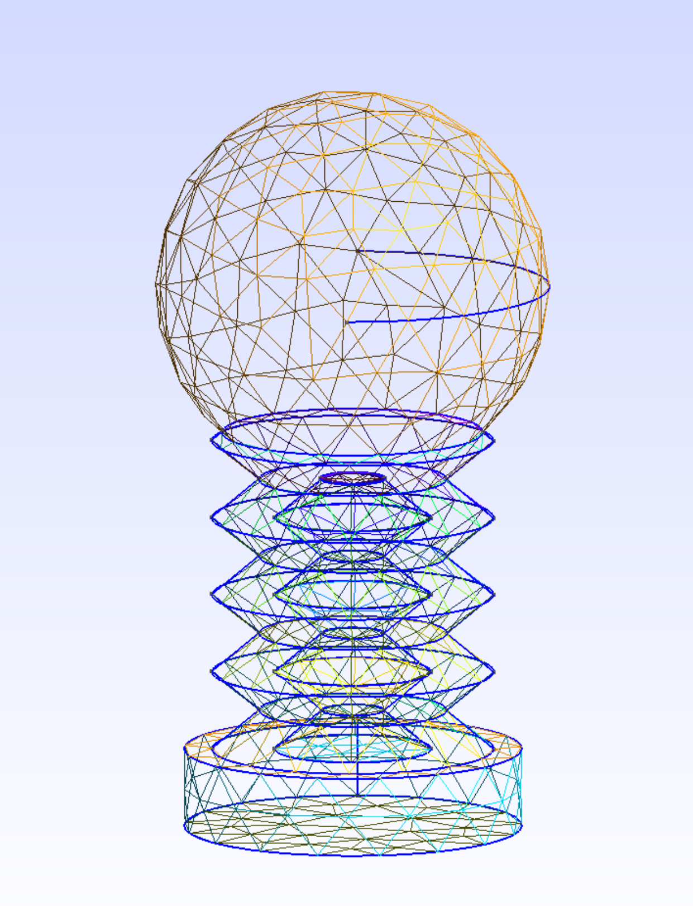
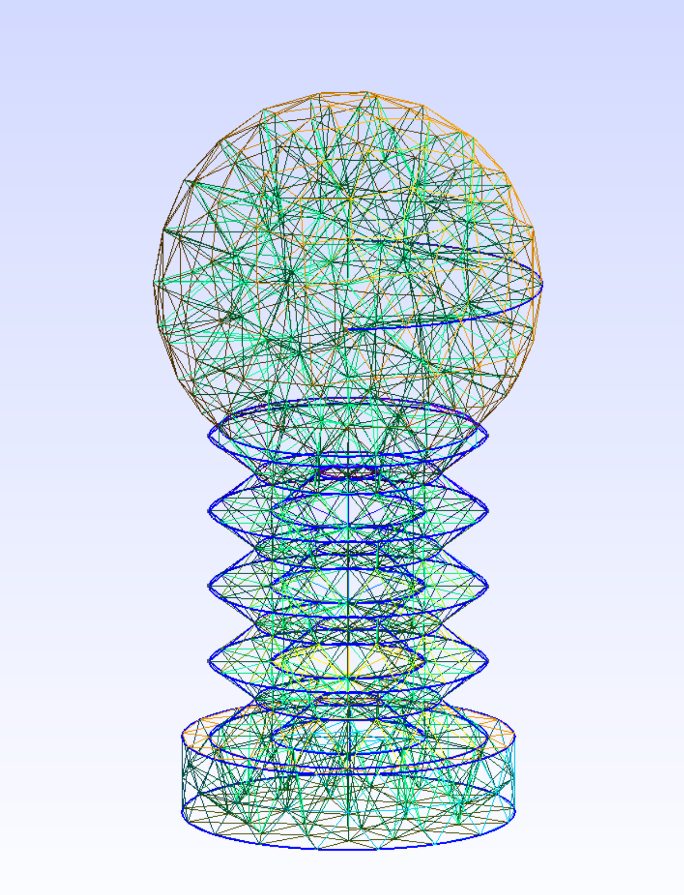
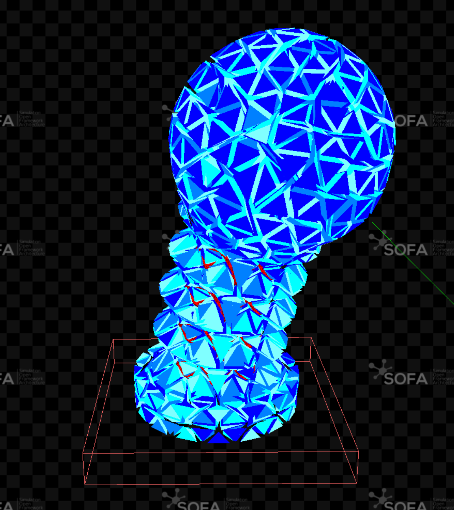

# Gmsh Tutorial for Parametric Designs
More detailed documentation coming soon!
For now, consider the following essentials:
- Using the Python 3 bindings for Gmsh, we can leverage all the available functionality to create (program) and automatically mesh parametric designs.
- Inside the AccordionGeneration.py-script, there is a variable `Step=7`, which allows you to step through the tutorial "by hand". Choose a step between 1 and 9 and run the script to see the intermediate results.
- Once the meshes needed for simulation are created, the example SOFA-scene "SurfacePressureConstraint_Accordion.py" can be run.

Here are some intermediate steps of the tutorial. 

* Step 1: Construction is started by defining points:

 

* Step 3: Planar surface of an accordion shape:

 

* Step 5: Revolved body of the accordion shape:

 

* Step 7: Finished pawn body with generated surface mesh:

 

* Step 8: Finished pawn body with generated volumetric  mesh:

 

* Simulation in SOFA using the generated meshes (volumetric and interior cavity surface):

 
